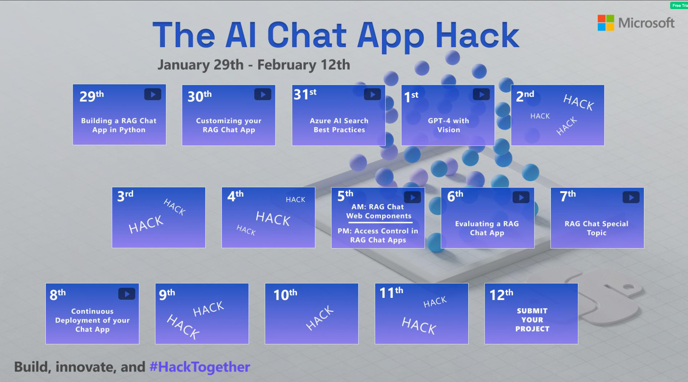
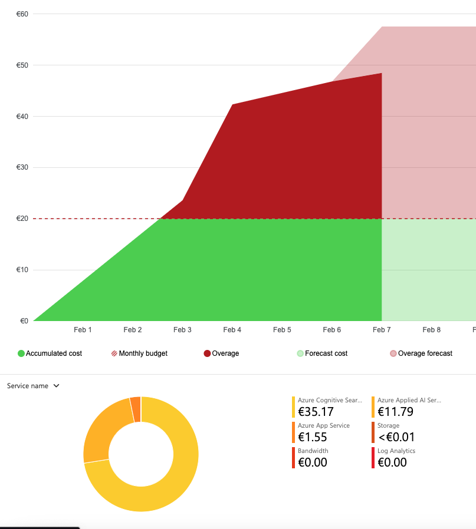
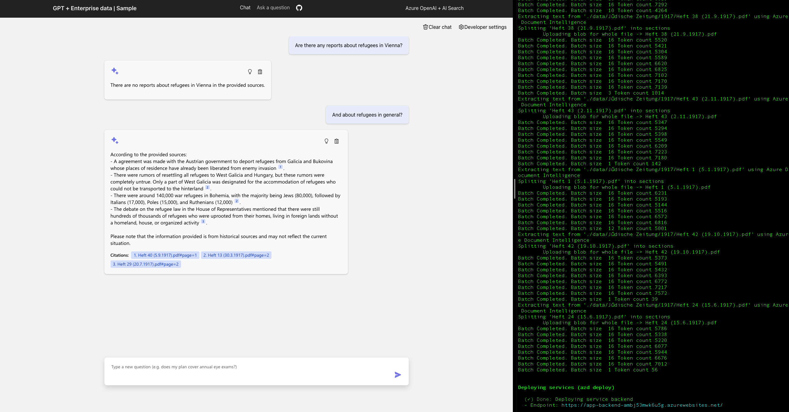
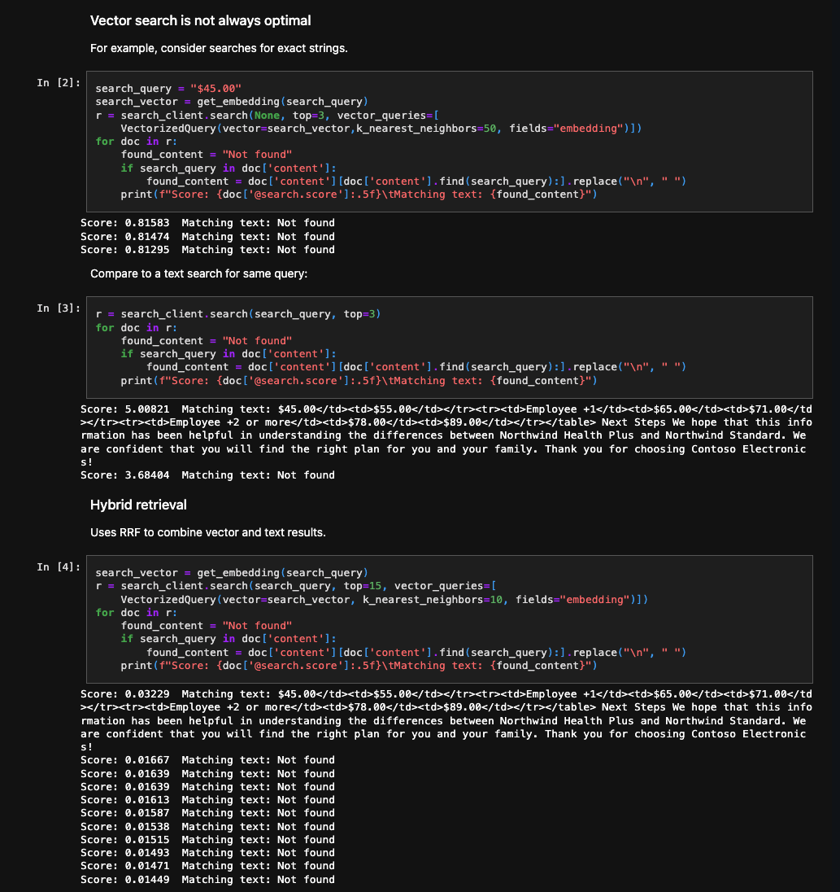
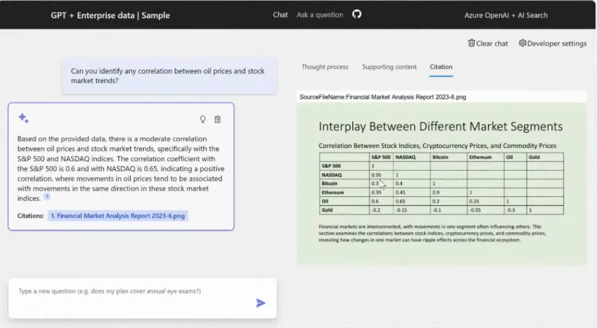
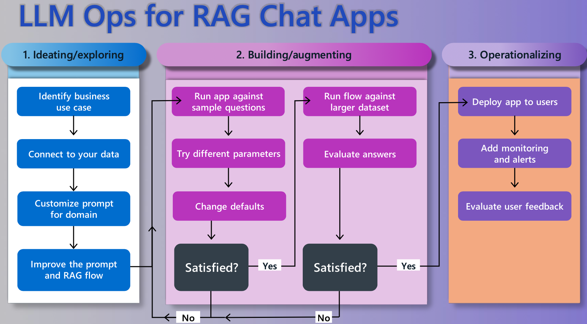
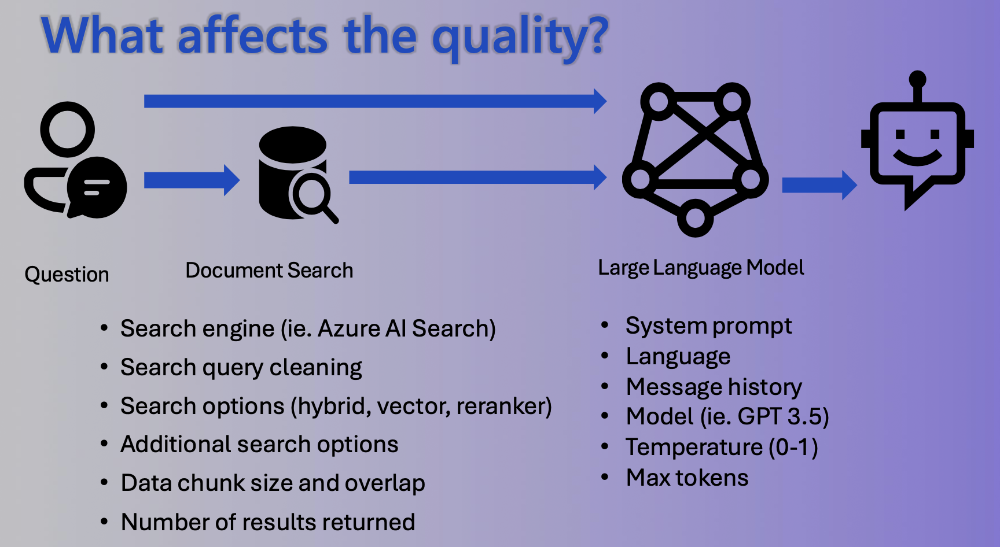

# Enhancing Historical Research with RAG Chatbots

## Context of Use Case

The project idea revolves around the development of a chatbot designed to assist researchers in navigating through vast and complex sources. Specifically, the focus is on historical newspapers, such as the "Jüdische Zeitung," a pre-war Jewish newspaper from Vienna. These documents are printed in the "Fraktur" typeface, which, while offering a rich resource for historians, presents significant readability challenges for modern German speakers due to its antiquated design.

This project aims to transform the way historians interact with historical documents, making it easier to uncover and interpret the rich stories contained within them.

## Goals

1. **Accessibility**: The primary goal is to reduce the mental effort and time historians currently invest in studying newspapers printed in antiquated typefaces. By simplifying the process of reading through such materials, the chatbot aims to significantly enhance the efficiency of historical research.

2. **Search by Topics**: Considering the weekly publication frequency of resources like the "Jüdische Zeitung," a major challenge for historians is locating relevant articles amidst vast amounts of information. The chatbot will enable users to search for articles by specific topics, streamlining the research process.

3. **Uncover Hidden Gems**: During wartime, newspapers were subjected to censorship, forcing editors to employ subtle methods of reporting on sensitive issues. These "codes" are often overlooked in the original sources. A chatbot, powered by a Long-Short Term Memory-Recurrent Attention Gate (LLM-RAG) model, could prove invaluable in identifying these hidden messages.

## Challenges & Learnings for implementation

1. **(Optical) Character Recognition**: A significant technical challenge is the recognition of the "Fraktur" typeface. The pre-build parser struggled with that. The solution would be to build a custom parser which can handle the Fraktur typeface. This is a very time-consuming task and requires a lot of domain knowledge. There are also other commercial solutions which worked fair well although there are still mismatches. See the [original document](/data/Dr.%20Bloch's%20oesterreichische%20Wochenschrift/1917/Heft%201%20(5.1.1917).pdf) and the [OCR](/3_Benchmarks/Fraktur%20Benchmark%20-%20Bloch%20-%2005.01-2017-%20title.txt) result. In consideration of limited time, I decided to use the pre-build parser and to focus on the other parts of the project.

2. **Checking for Quality and Utilisation**: The chatbot should prioritize relevancy when presenting articles related to specific queries, such as those about the region "Galicia." A general problem for the bot is that "Galicia" is very often mentioned in the sources. I didn't solve this problem. The end user would have to dig deeper with more and more specific queries.

3. **Preference for Sources**: While the primary focus is on original sources, the chatbot will also utilize literature and excerpts about the topic for additional context. It is crucial to develop a system that prioritizes original sources without excluding valuable supplementary materials.

## Quick Links

- [Application link for Archive Companion](https://app-backend-ambj53mwk6u5g.azurewebsites.net/)
- [MS Example Repo for RAG Chat with 63 contributors and nearly 5k stars](https://github.com/Azure-Samples/azure-search-openai-demo)
- [Hackathon Repo](https://github.com/microsoft/AI-Chat-App-Hack)
- [Project links of other hackathon participants including videos, endpoints and links to repos](https://github.com/microsoft/AI-Chat-App-Hack/issues)

## Todo

- [x] Check how the code works in detail
- [x] Read through doc: <<https://techcommunity.microsoft.com/t5/ai-azure-ai-services-blog/azure-ai-search-outperforming-vector-search-with-hybrid/-> ba-p/3929167>
- [x] Go through Search Approach: Understand what Hybrid Retrieval means
- [ ] Find out how expensive it was to build the App and how the cost was produced. (e.g. for Upload / Chunking for documents with 350 mb in total it was rougly 15 euros)
  - [ ] There is a split down between running costs and using Azure Document Intelligence to parse the documents.
- [ ] Watch the Custom RAG Chatvideo till the end. A lot of customisation opportunities: <https://www.youtube.com/watch?v=vt7oZg4bPAQ>
- [x] Go through "builidng a Rag Chat App to slide 26 - a code walkthrough! Very important!
- [ ] Add the Github ressources of the video to this doc: <https://www.youtube.com/watch?v=TI85JJVPnrM&t=1212> and  <https://github.com/sqlshep/OpenAI> - data pricacy etc. is mentionend there
- [ ] Add these repo for a lot of great patterns: <https://github.com/microsoft/azure-openai-design-patterns>
- [ ] at the end add table of content for the readme
- [ ] Add LLM picture: https://miro.medium.com/v2/resize:fit:4800/format:webp/1*hP_OK4fBONVm_zEVgh4ZQA.gif
- [ ] Describe your use case
  - What is your personal goal in the hackathon?
    - Understanding what Cognigy Knowledge Ai is behind the hood.
    - With that knowledge I want to be able evaluate the solution of the Cognigy platform better and understand the limitations and possibilitis
    - For Customer Projects, to know early where the limitations are and how to deal with them.
  - What problem are you solving?
    - Brief explanatio of your thesis
    - Main challenges while writing (Fraktur, endless data and clustering)
  - Why did you think the bachelor thesis is a good use case for the hackathon?
    - Known sources & relevant questions to the sources = better to evaluate the results
    - Difficult case of parsing Fraktur - how to deal with difficult data sources
    - Fun - If I could travel back in time, I would like to handover this app to the younger me!



## Table of Content

[ ] Update at the end

- [Enhancing Historical Research with RAG Chatbots](#enhancing-historical-research-with-rag-chatbots)
  - [Context of Use Case](#context-of-use-case)
  - [Goals](#goals)
  - [Challenges \& Learnings for implementation](#challenges--learnings-for-implementation)
  - [Quick Links](#quick-links)
  - [Todo](#todo)
  - [Table of Content](#table-of-content)
  - [A) Building a RAG Chat App](#a-building-a-rag-chat-app)
    - [How can you incorporate your own knowledge?](#how-can-you-incorporate-your-own-knowledge)
    - [Why RAG and not just GPT (an LLM)?](#why-rag-and-not-just-gpt-an-llm)
    - [How does RAG work?](#how-does-rag-work)
    - [Explain typical RAG components](#explain-typical-rag-components)
    - [What kind of skillset is needed to build a RAG based chatbot?](#what-kind-of-skillset-is-needed-to-build-a-rag-based-chatbot)
    - [Explain how the repo works](#explain-how-the-repo-works)
      - [Process Flow](#process-flow)
      - [Architecture Components](#architecture-components)
      - [Deployment (steps in readme.md below)](#deployment-steps-in-readmemd-below)
      - [Azure AI Search Pricing Insights](#azure-ai-search-pricing-insights)
      - [Cost Reduction Strategies](#cost-reduction-strategies)
      - [Ingestion of your Data Azure Search OpenAI Demo - Data Ingestion Guide](#ingestion-of-your-data-azure-search-openai-demo---data-ingestion-guide)
      - [Chatting with the Bot](#chatting-with-the-bot)
      - [What does the thought process of the app looks like?](#what-does-the-thought-process-of-the-app-looks-like)
  - [B) How to customize the RAG Chatbot](#b-how-to-customize-the-rag-chatbot)
    - [How to run the chatbot locally](#how-to-run-the-chatbot-locally)
      - [Hotloading the Backend](#hotloading-the-backend)
      - [Hotloading the Frontend](#hotloading-the-frontend)
    - [ Code Walkthrough](#code-walkthrough)
      - [Frontend](#frontend)
      - [Backend](#backend)
    - [Customizing the frontend](#customizing-the-frontend)
    - [Customizing the backend](#customizing-the-backend)
    - [Frontend - What is the Chat and Ask Tab?](#frontend---what-is-the-chat-and-ask-tab)
    - [How to deal with data which is not a PDF?](#how-to-deal-with-data-which-is-not-a-pdf)
      - [Converting webpages to PDFs](#converting-webpages-to-pdfs)
    - [Other approach: Write a a custom parser](#other-approach-write-a-a-custom-parser)
  - [C) Connecting a RAG chat app to Azure Cosmos DB](#c-connecting-a-rag-chat-app-to-azure-cosmos-db)
  - [D) Azure AI Search Best Practices](#d-azure-ai-search-best-practices)
    - [Retrieval Matters](#retrieval-matters)
    - [Vector Search](#vector-search)
      - [Vector embeddings](#vector-embeddings)
      - [Demo how to compute a vector and use it for search with OpenAi ada-002 vector embeddings](#demo-how-to-compute-a-vector-and-use-it-for-search-with-openai-ada-002-vector-embeddings)
    - [Strategies for Vector Search](#strategies-for-vector-search)
    - [Hybrid Search - best of both worlds](#hybrid-search---best-of-both-worlds)
      - [What is used in Azure Ai Search?](#what-is-used-in-azure-ai-search)
      - [Hint: Chunking and Search Strategy](#hint-chunking-and-search-strategy)
      - [Demo to demonstrate the search methods](#demo-to-demonstrate-the-search-methods)
    - [Indexing data in Azure Ai Search](#indexing-data-in-azure-ai-search)
      - [Manual Indexing - How can you add your custom chunking?](#manual-indexing---how-can-you-add-your-custom-chunking)
      - [Cloud-based chunking](#cloud-based-chunking)
  - [E) GPT-4 with Vision](#e-gpt-4-with-vision)
  - [F) RAG Chat Web Components](#f-rag-chat-web-components)
  - [ G) Access Control in Generative Ai](#g-access-control-in-generative-ai)
    - [How can I make sure that the user can only access the data which is allowed?](#how-can-i-make-sure-that-the-user-can-only-access-the-data-which-is-allowed)
  - [ H) Evaluating a RAG Chat App](#h-evaluating-a-rag-chat-app)
    - [Operational Lifecycle for RAG Chat App Development](#operational-lifecycle-for-rag-chat-app-development)
    - [Quality of RAG: Are the answers high quality?](#quality-of-rag-are-the-answers-high-quality)
    - [ Where to expirment with the prompts and retrieval?](#where-to-expirment-with-the-prompts-and-retrieval)
    - [ Manual Evaluation/Experimentation](#manual-evaluationexperimentation)
      - [Types of prompts](#types-of-prompts)
      - [How to create the System Prompts?](#how-to-create-the-system-prompts)
      - [The "Prompt Forumula"](#the-prompt-forumula)
        - [Prompt Formula Components Ranked by Importance](#prompt-formula-components-ranked-by-importance)
    - [ Automated Evaluation](#automated-evaluation)
    - [ Quality Monitoring](#quality-monitoring)
  - [ I) Chat Completion API Tools \& Functions in RAG Chat Apps](#i-chat-completion-api-tools--functions-in-rag-chat-apps)
  - [ J) Continuous Deployment of your Chat App](#j-continuous-deployment-of-your-chat-app)
  - [ K) Content Safety for Azure OpenAI](#k-content-safety-for-azure-openai)
  - [ L) Building a Chat on your Business Data without writing a line of code](#l-building-a-chat-on-your-business-data-without-writing-a-line-of-code)
  - [Learnings](#learnings)
    - [1. What is an optimal chunk size and a optimal overlap?](#1-what-is-an-optimal-chunk-size-and-a-optimal-overlap)
      - [Technology behind Azure Ai Search](#technology-behind-azure-ai-search)
      - [Experiments for Search Methods](#experiments-for-search-methods)
      - [Experiment for Chunking Strategies](#experiment-for-chunking-strategies)
      - [What to do with these results in CAI?](#what-to-do-with-these-results-in-cai)
      - [Retrieval is crucial for the success of the RAG Chatbot](#retrieval-is-crucial-for-the-success-of-the-rag-chatbot)
    - [Further interesting points](#further-interesting-points)
      - [TODO: What kind of Skillsets are needed for building a RAG Chatbot?](#todo-what-kind-of-skillsets-are-needed-for-building-a-rag-chatbot)
      - [TODO: What are your most important learnings and why?](#todo-what-are-your-most-important-learnings-and-why)
      - [TODO: Top Challenges](#todo-top-challenges)
    - [ Cost Estimations](#cost-estimations)
    - [Lessons Learned: Do courses - always include hands on parts](#lessons-learned-do-courses---always-include-hands-on-parts)
    - [Lessons Learned: Managing Costs](#lessons-learned-managing-costs)
    - [Lessons Learned: User Interaction to GPT Model](#lessons-learned-user-interaction-to-gpt-model)
    - [Lessons Learned: Cogingy](#lessons-learned-cogingy)
        - [Evaluation if data was read correctly](#evaluation-if-data-was-read-correctly)
      - [RAG Development Cycle](#rag-development-cycle)
    - [Further Improvements](#further-improvements)
      - [Generate Prompts](#generate-prompts)
      - [There is no golden prompt template](#there-is-no-golden-prompt-template)
    - [ Hot to put the chatbot into production](#hot-to-put-the-chatbot-into-production)
    - [ Next Learning steps](#next-learning-steps)

## A) Building a RAG Chat App

- **Slides**: [Building a RAG Chat App](2_slides/AIChatAppHack_BuildingARAGChatApp.pdf "Click to open the PDF")

- **Video**: [Live Session](https://www.youtube.com/watch?v=hX1yaUBpM4s)

### How can you incorporate your own knowledge?

- **Prompt Engineering**: You can give the LLM a bit of context but it only works if it has the knowledge inside it. Often it also halicinates knowledge which looks correct but if you are a domain expert you can see that it is wrong. So prompt engineering Can be helpful but normally not enough.
  - Example using Custom GPTs of OpenAI: Searching for "Indian food", see [Custom GPT | Salad Market - create your own salad recipe](https://chat.openai.com/g/g-dI7cfBY99-salad-market-create-your-own-salad-recipe)
- **Fine tuning**: You can fine tune the LLM on your own data. But this is very expensive and you need a lot of data. This is a valid option when your use case is very specialisd, you have a lot of data and you need very high accuracy, then this is probably the way to go. For most of company use cases it's not a good option economically.
- **Retrieval Augmented Generation (RAG)**: You can use a retrieval system to find the most relevant documents and then use the LLM to generate the answer. This is the approach we are using in this project.

### Why RAG and not just GPT (an LLM)?

LLMs are good at Language but not at Reasoning. RAG is a combination of both. It is a hybrid approach.

- **Knowledge Cutoff**: There is a always a cut-off time for the training data of LLMs. So from this day on, the knowledge available is already outdated.
- **Only public knowledge**: LLMs are trained on public knowledge. All sources which are interal to a company or behind a paywall are not included in the training data.


### How does RAG work?

- The user asks a question, then you take it and search for fitting documents in a knowledge base.
- Afterwards you take the orginal user question together with the chunks from the knowledge base and feed it into the LLM to generate the answer.
- Typical for a RAG based system is that the user will get the sources of the answer as well, so he can evalute the answer himself.

### Explain typical RAG components


- **Retriver**: A knowledge base which is used to find the most relevant documents for a given question. This can be a search engine or a database which support vector search. (Azure Ai Search, CosmosDB, Postgres (<https://github.com/pgvector/pgvector>), Weaviate, Qdrant, Pineconce...)
- **LLM** A Model which can answers the questions based on the provided sources and can include citations (GPT3.5 / 4 Models, etc.)
- **Integration Layer ("Glue" in MS Slides)**: Optional Middleware which helps to connect the Retriver and the LLM. It can also be used to cache the results of the Retriver to speed up the process. It can be also done in pure Python but there are libaries which can help you with that. (Langchain, LLammaindex, Semantic Kernel, etc.)
- **Additional Features**: You can add additional features to your chatbot like chat history, Feedback buttons, Text to Speech, User Login, File Upload, etc.

### What kind of skillset is needed to build a RAG based chatbot?

- **No Code**: For easy applications using Copilot Studio of Azure or OpenApi GPT Builder. This might be enough for simple use cases.
- **Low Code**: UIs which help you to build more complex cases but within a UI (e.g. Azure Studio - On Your Data). There you can add hardware compontents (Retrievers as Azuer Ai Search, differen LLMs, Features as User Authentication, Chat History persistace.)
- **Code**: For Code base there are a lot of Azure Examples or for other suppliers as well. An example is the Azure RAG Chatbot which is used in this project <https://github.com/Azure-Samples/azure-search-openai-demo>.

### Explain how the repo works


#### Process Flow

1. The user enters input into the Website.
2. The App Server/Orchestrator receives this input and formulates a query.
3. The query is sent to Azure Cognitive Search, which retrieves relevant knowledge from the connected Data Sources.
4. The retrieved knowledge, along with the original prompt, is sent to Azure OpenAI.
5. Azure OpenAI processes the prompt and knowledge to generate a natural language response.
6. This response is sent back to the App UX through the App Server/Orchestrator for the user to view.

#### Architecture Components

| Resource Name     | Type                  | Role in Architecture                                                                      | Note |
|-------------------|-----------------------|-------------------------------------------------------------------------------------------|------|
| Website or other channel            | User Interface        | The front-end component where users interact with the chatbot.                            | Not an Azure infrastructure element; represents the user interface layer. |
| app-backend-xxx   | App Service           | Hosts the backend application that serves as the orchestrator between the App UX, Azure Cognitive Search, and Azure OpenAI. | Azure infrastructure element. |
| cfg-xxx           | Configuration/Settings| Manages configuration for document understanding and processing, possibly related to the chatbot’s AI model training and response formulation. | Azure infrastructure element. |
| gptkb-xxx         | Azure Cognitive Search| Handles data indexing and querying, pulling relevant information from various data sources to aid response generation. | Azure infrastructure element. |
| plan-xxx          | App Service Plan      | Determines the compute resources allocated for the App Service, affecting performance and scalability. | Azure infrastructure element. |
| stamjb-xxx        | Storage Account       | Stores blobs, files, and the data sources (like documents) used by the chatbot for information retrieval. | Azure infrastructure element. |
| Azure OpenAI      | AI Service            | Integrates with OpenAI's API to generate natural language responses based on user input and information from Azure Cognitive Search. | Represents the integration with an external AI service provided by OpenAI, not an Azure service itself. |
| Data Sources      | Various Databases     | Comprises SQL, blob storages, Cosomos DB and other data storage services that house the data the chatbot accesses. | Not a single Azure infrastructure element; this represents the actual data repositories, which may be hosted on Azure. |

#### Deployment (steps in readme.md below)

- **Read the Cost Estimations Section**: Refer to the cost estimations section below before proceeding.
- **Deployment Guide**: Follow the deployment guide available at [Azure Deployment Guide](https://github.com/Azure-Samples/azure-search-openai-demo/tree/main?tab=readme-ov-file#azure-deployment).
- **Infrastructure Deployment**: The infrastructure, backend, and frontend will be deployed to Azure using the Bicep templates.
- **Configuration of Infrastructure**: Configurations for the infrastructure can be made through environment variables in the `azd.env` file.
- **Frontend and Backend Configuration**: Configuration for both the frontend and backend can be done in the `app` folder. (See below for details)
- **Interacting with the Bot**: Users can chat with the bot through the frontend. The frontend is developed as a React application.
- **Backend Details**: The backend is a Python application that utilizes the Quart framework.

#### Azure AI Search Pricing Insights



- The main cost driver was Azure AI Search, not OpenAI.
- Standard S1 Plan: $245/month, necessary for >2GB data. [Azure Search Pricing Details](https://azure.microsoft.com/en-gb/pricing/details/search/).
- For up to 2GB of data: $75/month.

#### Cost Reduction Strategies

- Explore free or lower-cost deployment options:
  - [Low-cost Deployment Guide](https://github.com/Azure-Samples/azure-search-openai-demo/blob/main/docs/deploy_lowcost.md)
  - [Tools to estimate costs for Azure](https://github.com/Azure-Samples/azure-search-openai-demo/tree/main?tab=readme-ov-file#azure-deployment)
  - [Instructional Video for Low-Cost Deployment](https://www.youtube.com/watch?v=nlIyos0RXHw)

#### Ingestion of your Data [Azure Search OpenAI Demo - Data Ingestion Guide](https://github.com/Azure-Samples/azure-search-openai-demo/blob/main/docs/data_ingestion.md)


- `data` (folder) - Contains the data sources (PDFs, etc.) for the chatbot.
- `scripts` (folder) - Contains Python scripts to upload the data to Azure.
  1. Upload the data to **Azure Blob Storage**.
  2. Process the data using **Azure Document Intelligence**. (Extract the data from PDFs, etc.), see also ([Docs](https://learn.microsoft.com/en-us/azure/ai-services/document-intelligence/concept-retrieval-augumented-generation?view=doc-intel-4.0.0)
  3. Splitting data into chunks via **Azure Document Intelligence**.
  4. Creating embeddings for the data using **Azure Document Intelligence**, see also ([Docs](https://learn.microsoft.com/en-us/azure/search/search-indexer-overview))
  5. Storing the embeddings and the data in **Azure AI Search** in an index.
- There are alternatives to all of these components, e.g, using a custom parser locally. This can reduce costs and optimise the process for your specific use case. Below in the Azure AI Search Best Practices section, there are some examples of how to do that.

Manual Indexing (see also below in the Azure AI Search Best Practices section):




#### Chatting with the Bot

- **Frontend to Backend Communication**: The frontend captures the user's input and forwards it to the backend. The backend, in turn, sends this input to the OpenAI API and then relays the response back to the frontend.
- **Document Retrieval and Answer Generation**: In addition to interacting with the OpenAI API, the backend utilizes Azure Search to fetch documents, which are then used by the OpenAI API to formulate responses.
- **User Interface Tabs**: The interface offers two distinct tabs for interaction:
  - **Chat Tab**: Designed for multi-turn conversations, allowing for a more dynamic and engaging dialogue.
  - **Ask Tab**: Meant for single-turn queries, providing straightforward, concise answers.
- **Response Content**: Responses are comprehensive, including not only the direct answer but also citing the sources of the information. Additionally, the prompt used and the methodology behind generating the answer are disclosed, essentially revealing the "thought process."

#### What does the thought process of the app looks like?

You can check that at the frontend. There is a button "Show Thought Process" which will show you the sources and the prompt which was used to generate the answer. It consisis of the following parts:


- **User Query**: The original question asked by the user.

```Javascript
  "user_query": "Do the sources mention protests?"
```

- **Generate Search Query**: The search query used to retrieve documents from the knowledge base.

```Javascript
  "generate_search_query": "protests"
```

- **Search Results**: The documents retrieved from the knowledge base.

```Javascript
  [
  {
    "id": "file-Heft_10__9_3_1917__pdf-486566742031302028392E332E31393137292E706466-page-21",
    "content": " Jeder mun immer wieder erstaunt sein uber die ungeheure Zähigkeit des jüdischen Volkes, über die Kraft, die auch in der ungebildeten Masse aufgespeichert ist. Gelingt es, die kleine Zahl intellektuenter Führer dem poinischen Ju- dentum zu erhalten, über die es heute verfügt, indem man die Widerstandskraft dieser Männer gegen ein widriges Geschick stärkt, und gelingt es, den neuen heranstrebenden Kräften die Mog- lichkeit einer Ausbildung zu erofinen, so wird das getan, was alle Kreise des nationalen Juden- tums in Polen fordern.\nDer Prager Erlaß\nDer jüdische Nationalverein für Oesterreich hat zu Ende wosiger Woche einen scharfen Protest -gegen die Mallaahmen der Prager Behörden, durch welche die Freizügigkeit der jüdischen Flüchtlinge aus Galizien und der bukowina be- schränkt wurde, an das Ministerium des Innern gerichtet und um sofortige Aufhebung der ge- troffenen Ausnahmsverfügungen gebeten. Wie wir erfahren, sind inzwischen diese Verordnungen sistiert worden.\nPolitische Rechte der Flüchtlinge\nIm Wiener Rathause hatte am 22.",
    "embedding": "[-0.004997284, -0.0013775431 ...+1534 more]",
    "imageEmbedding": null,
    "category": null,
    "sourcepage": "Heft 10 (9.3.1917).pdf#page=2",
    "sourcefile": "Heft 10 (9.3.1917).pdf",
    "oids": [],
    "groups": [],
    "captions": []
  },
  {
    "id": "file-Heft_44-45__9_11_1917__pdf-486566742034342D34352028392E31312E31393137292E706466-page-44",
    "content": "Schmiegsamkeit und geradezu anekelnden Anbiederungspolitik ver- mochte das Blatt sich nicht länger zu halten. Alle Subsidien versiegten. Die Abonnenten haben eigentlich längst das Blatt aufgegeben.\" Und da auch die verschiedensten Wiederbelebungsver- suche in der letzten Zeit versagt hatten, war das Blatt dem Untergange geweiht. - Noch ein Be- weis für die Hinfälligkeit der assimilatorischen Richtung. Den wuchtigsten, weil den Todesstoß haben die Polen dem Blatte versetzt. Für die Po- len, oder ihnen zu Gefallen wurde eigentlich das Blatt vor zwölf Jahren gegründet. aber es stützte sich fast immer nur auf jüdische Leser. Ein Blatt ohne Richtung und ohne eigentliches Programm. stets nur nach den verschiedenen Windrichtungen auslugend, hatte es keine Existenzberechtigung und mußte endlich eingehen.\nUnter diesen vielen jüdischen Flüchtlingen sind noch jene Kriegsopfer nicht mitgezählt. die ihre letzten Mittel aufzehren und der staatlichen Fürsorge nicht tellhaftig wurden.\nProtest des jüdischen Militärvereines in Pe- tersburg. In der russisch-jüdischen Presse ver- öffentlicht der jüdische Militärverein einen scharfen Protest gegen die geheimen Verordnungen eines Stabskommandanten ",
    "embedding": "[-0.02443394, -0.004634023 ...+1534 more]",
    "imageEmbedding": null,
    "category": null,
    "sourcepage": "Heft 44-45 (9.11.1917).pdf#page=4",
    "sourcefile": "Heft 44-45 (9.11.1917).pdf",
    "oids": [],
    "groups": [],
    "captions": []
  },
  {
    "id": "file-Heft_28__13_7_1917__pdf-48656674203238202831332E372E31393137292E706466-page-46",
    "content": " Ueberdies haben mehrere Pro- testversammlungen stattgefunden, Die Leitung der „Gesellschaft der Freunde\" hat zum Protest ihre Delegierten aus dem „,Conjoint Comittee“ zu- rückgezogen. Auch in anderen jüdischen Organi- sationen Englands wurde die Haltung des „,Ver- einigten Komitees\" abfällig kritisiert. Vergebens versuchten einige dem Judentum entfremdete Lords in der „Times“ den schlechten Eindruck, den das Komitee in der Oeffentlichkeit gemacht hatte, zu verwischen. Kennzeichnend ist, daß sich gegen diese nichtreligiösen Lords, die in der „Times\" erklärten, das Judentum wäre nicht eine nationale, sondern eine religiose Gemeinschaft, die orthodoxen Synagogen Englands aussprachen; - Des weitern meldet dasselbe Korrespondenz- Buro: In Glasgow hat auf einer jüdischen Volksversammlung das bekannte Mitglied des englischen Parlaments Joseph King die Haltung des „Conjoint Comitee\" als volksfeindlich kri- tisiert und ein jüdisches Palästina als einzige Lösung der Judenfrage bezeichnet. Desgleichen hat ein anderer Abgeordneter in einer Versamm'- lung der „Bnci Brithloge\" in London für den Zionismus ",
    "embedding": "[-0.015009237, 0.0012998359 ...+1534 more]",
    "imageEmbedding": null,
    "category": null,
    "sourcepage": "Heft 28 (13.7.1917).pdf#page=4",
    "sourcefile": "Heft 28 (13.7.1917).pdf",
    "oids": [],
    "groups": [],
    "captions": []
  }
]
```

- **Prompt to GPT**: The prompt used to generate the answer. It includes a context for the GPT model, the orginal user request and the search results (text of the sources which was found to answer the query).

```Javascript
  [
  "{'role': 'system', 'content': '\\n            This assistant is designed to support academic researchers, particularly historians, by extracting and providing precise information from a designated list of sources. \\n\\n            Guidelines for the Assistant:\\n            1. Deliver Accurate and Relevant Information: Focus on accuracy and relevance in your responses. \\n            2. Brevity: Keep answers concise and to the point.\\n            3. Source-Based Responses: Only use facts from the provided list of sources. If a source lacks sufficient information, admit the limitation. Avoid creating responses that do not directly utilize these sources.\\n            4. Clarifying Questions: If clarification from the user could lead to a more accurate response, do not hesitate to ask.\\n            5. Response Formatting: For responses involving tabular data, present them in HTML format. Avoid using markdown.\\n            6. Language Consistency: Answer in the same language as the question posed.\\n            7. Source Attribution: Include the name of the source for every fact cited in your response. Use square brackets for source referencing, e.g., [info1.txt]. Do not merge information from different sources; cite each one separately, e.g., [info1.txt][info2.pdf].\\n\\n            \\n            \\n        '}",
  "{'role': 'user', 'content': 'Do the sources mention protests?\\n\\nSources:\\nHeft 10 (9.3.1917).pdf#page=2:  Jeder mun immer wieder erstaunt sein uber die ungeheure Zähigkeit des jüdischen Volkes, über die Kraft, die auch in der ungebildeten Masse aufgespeichert ist. Gelingt es, die kleine Zahl intellektuenter Führer dem poinischen Ju- dentum zu erhalten, über die es heute verfügt, indem man die Widerstandskraft dieser Männer gegen ein widriges Geschick stärkt, und gelingt es, den neuen heranstrebenden Kräften die Mog- lichkeit einer Ausbildung zu erofinen, so wird das getan, was alle Kreise des nationalen Juden- tums in Polen fordern. Der Prager Erlaß Der jüdische Nationalverein für Oesterreich hat zu Ende wosiger Woche einen scharfen Protest -gegen die Mallaahmen der Prager Behörden, durch welche die Freizügigkeit der jüdischen Flüchtlinge aus Galizien und der bukowina be- schränkt wurde, an das Ministerium des Innern gerichtet und um sofortige Aufhebung der ge- troffenen Ausnahmsverfügungen gebeten. Wie wir erfahren, sind inzwischen diese Verordnungen sistiert worden. Politische Rechte der Flüchtlinge Im Wiener Rathause hatte am 22.\\nHeft 44-45 (9.11.1917).pdf#page=4: Schmiegsamkeit und geradezu anekelnden Anbiederungspolitik ver- mochte das Blatt sich nicht länger zu halten. Alle Subsidien versiegten. Die Abonnenten haben eigentlich längst das Blatt aufgegeben.\" Und da auch die verschiedensten Wiederbelebungsver- suche in der letzten Zeit versagt hatten, war das Blatt dem Untergange geweiht. - Noch ein Be- weis für die Hinfälligkeit der assimilatorischen Richtung. Den wuchtigsten, weil den Todesstoß haben die Polen dem Blatte versetzt. Für die Po- len, oder ihnen zu Gefallen wurde eigentlich das Blatt vor zwölf Jahren gegründet. aber es stützte sich fast immer nur auf jüdische Leser. Ein Blatt ohne Richtung und ohne eigentliches Programm. stets nur nach den verschiedenen Windrichtungen auslugend, hatte es keine Existenzberechtigung und mußte endlich eingehen. Unter diesen vielen jüdischen Flüchtlingen sind noch jene Kriegsopfer nicht mitgezählt. die ihre letzten Mittel aufzehren und der staatlichen Fürsorge nicht tellhaftig wurden. Protest des jüdischen Militärvereines in Pe- tersburg. In der russisch-jüdischen Presse ver- öffentlicht der jüdische Militärverein einen scharfen Protest gegen die geheimen Verordnungen eines Stabskommandanten \\nHeft 28 (13.7.1917).pdf#page=4:  Ueberdies haben mehrere Pro- testversammlungen stattgefunden, Die Leitung der „Gesellschaft der Freunde\" hat zum Protest ihre Delegierten aus dem „,Conjoint Comittee“ zu- rückgezogen. Auch in anderen jüdischen Organi- sationen Englands wurde die Haltung des „,Ver- einigten Komitees\" abfällig kritisiert. Vergebens versuchten einige dem Judentum entfremdete Lords in der „Times“ den schlechten Eindruck, den das Komitee in der Oeffentlichkeit gemacht hatte, zu verwischen. Kennzeichnend ist, daß sich gegen diese nichtreligiösen Lords, die in der „Times\" erklärten, das Judentum wäre nicht eine nationale, sondern eine religiose Gemeinschaft, die orthodoxen Synagogen Englands aussprachen; - Des weitern meldet dasselbe Korrespondenz- Buro: In Glasgow hat auf einer jüdischen Volksversammlung das bekannte Mitglied des englischen Parlaments Joseph King die Haltung des „Conjoint Comitee\" als volksfeindlich kri- tisiert und ein jüdisches Palästina als einzige Lösung der Judenfrage bezeichnet. Desgleichen hat ein anderer Abgeordneter in einer Versamm\\'- lung der „Bnci Brithloge\" in London für den Zionismus '}"
]
```

## B) How to customize the RAG Chatbot

- **Slides**: [How to customize the RAG Chatbot](2_slides/AIChatAppHack_CustomizingYourRAGChatApp.pdf "Click to open the PDF")

- **Video**: [Live Session](https://www.youtube.com/watch?v=vt7oZg4bPAQ)

### How to run the chatbot locally

Watch also the video which explains this in detail. There is also the option to use the VC Code debugger to go through the code step by step.

#### Hotloading the Backend

- go to your local folder in vs code, open a terminal and run

```bash
  cd app
./start.sh
```

This will load the azd env file and start the backend and frontend. It automatically reloads the backend if you change something in the code.

- The backend is done on Quart (a Python framework based on Flask which supports async). It is a bit different from Flask but the same concepts apply. The frontend is in the folder `app/backend`. If you build a openai chat app like this, your backend should support async. The reasoning you can find in detail here: <https://blog.pamelafox.org/2023/09/best-practices-for-openai-chat-apps.html>

#### Hotloading the Frontend

- go to your local folder in vs code, open another terminal and run

```bash
  cd app/frontend
  npm run dev
```

then

  ```bash
    npm run dev
  ```

- this will give you a seperate localhost:5173 where you can see the frontend. It automatically reloads the frontend if you change something in the code. The backend request are going to the local server you've spun up in the other terminal.
- Be aware that in company network you may recieve proxy errors.

###  Code Walkthrough

#### Frontend

- **Technology**: TypeScript
- **Libraries/Frameworks**: React, FluentUI
- **Functionality**:
  - `chat.tsx`: Contains the UI components for the chat interface.
    - `makeApiRequest()`: Function to send requests to the backend API.
  - `api.ts`: Manages the API calls.
    - `chatApi()`: Interface to communicate with the chat service in the backend.

#### Backend

- **Technology**: Python
- **Libraries/Frameworks**: Quart, Uvicorn
- **Functionality**:
  - `app.py`: Main application file.
    - `chat()`: Function that handles chat requests.
  - `chatreadretrieveread.py`: Module for retrieving chat history and processing requests.
    - `run()`: Main entry point for running the chat service.
    - `get_search_query()`: Function to retrieve the search query from a request.
    - `compute_text_embedding()`: Function to compute embeddings for text analysis.
    - `search()`: Function to execute the search based on the query and embeddings.
    - `get_messages_from_history()`: Function to retrieve past messages for context.
    - `chat.completions.create()`: Function to generate chat responses.

### Customizing the frontend

To customize specific elements of the application, you should modify the following files:

| Change this file:                         | To customize:                 |
|-------------------------------------------|-------------------------------|
| `app/frontend/index.html`                 | title, metadata, script tag   |
| `app/frontend/public/favicon.ico`         | browser tab icon             |
| `app/frontend/src/pages/layout/Layout.tsx`| Navigation bar, colors        |
| `app/frontend/src/pages/chat/Chat.tsx`    | "Chat" tab and default settings |
| `app/frontend/src/pages/ask/Ask.tsx`      | "Ask" tab and default settings  |

### Customizing the backend

To customize specific elements of the backend, you should modify the following files:

| Change this file:                                     | To customize:                       |
|-------------------------------------------------------|-------------------------------------|
| `app/backend/app.py`                                  | additional routes, app configuration|
| `app/backend/approaches/chatreadretrieveread.py`      | "Chat" tab, RAG prompt and flow     |
| `app/backend/approaches/chatreadretrievereadvision.py`| "Chat" tab, RAG flow when using vision - this is still experimental in this current state|
| `app/backend/approaches/retrieveread.py`              | "Ask" tab, RAG prompt and flow      |
| `app/backend/approaches/retrievereadvision.py`        | "Ask" tab, RAG flow when using vision |

### Frontend - What is the Chat and Ask Tab?

- The Chat Tab is the tab where you can chat with the bot. You get the answer can ask follow up questions based on this. It's got context. It's a multi-turn conversation.
- The Ask Tab is the tab where you can ask a question and get an answer. It's a single turn conversation.

### How to deal with data which is not a PDF?

This part was mentionend in the live session and the slides. In case you need a deeper dive, look at the provided sources.

#### Converting webpages to PDFs

- Quick option is to save the webpage as PDF. Look in the slides of the Hackathon for more details and links.

### Other approach: Write a a custom parser

- it's merged to the repo by now. In details, look again at the Hackathon slides. There is some documentation how this can be done.
- There is also a [youtube video](https://www.youtube.com/live/vt7oZg4bPAQ?si=Kzh4tBtZX5Oo3I6K&t=2602) where the custom parser is explained in detail.

## C) Connecting a RAG chat app to Azure Cosmos DB

- **Slides**: [Connecting a RAG chat app to Azure Cosmos DB](2_slides/Hack_Cosmos.pdf "Click to open the PDF")

- **Video**: [Live Session](https://www.youtube.com/watch?v=cpbzQ-PfC4Y)

This session explains how to use Azure Cosmos DB (MongoDB of Azure) as a data source for a RAG chat app. For details see the slides and the video.

- Why CosmosDB?
  - It's ideal for semi-structured data.
  - It's a NoSQL database which is very flexible.
  - There is Vector Search support.
  - It's a fully managed service which is scalable and has a high availability.
  - This makes sense if you already have a datbase.

## D) Azure AI Search Best Practices

- **Slides**: [Azure AI Search Best Practices](2_slides/AIChatAppHack_AISearchBestPractices.pdf "Click to open the PDF")

- **Video**: [Live Session](https://www.youtube.com/watch?v=ODuDeDrs3F0)

### Retrieval Matters

- As by experience of the MS team, the retrieval is the most important part of the RAG Chatbot. If the answers are not good the cause behind this is often not the LLM but the retrieval.
- So it is important to work on a rebust retrieval system for RAG chat apps.
- For best results in Azure Ai Search, you will probably want to use a hybrid approach.
  - **Vector search** + **Keyword search** in parellel
  - Using a **RFF** (Reciprocal Rank Fusion) to combine the results of both methods
  - Then use the **Semantic Ranking** to rank the top results from the hybrid search

See the following slides for more details:
<https://speakerdeck.com/pamelafox/azure-ai-search-best-practices-for-rag-chat-apps?slide=6>

### Vector Search

What is Vector Search based on? What are their strengths and weaknesses?

#### Vector embeddings

- Take a text and convert it into a list of floating point numbers (vector), so the the text is represented as a vector.
- There are very different models for this. The most common ones are:
  - **Word2Vec**: A classic model which takes in words
  - **OpenAi ada-002**: A model which takes in sentences
  - **Azure Computer Vision**: A model which takes in images or text
  
#### Demo how to compute a vector and use it for search with OpenAi ada-002 vector embeddings

Source: <https://github.com/pamelafox/vector-search-demos/blob/main/vector_embeddings.ipynb>

- create a vector representation of a text (list of floating point numbers)
- with this vector you can search for similarities to other embeddings. For this you calculate the distance, usually the cosine distance. The code shows a couple of examples. It's important to mention that it's the relevant distance between the cosines not the absolutes.
- in the demo there is a list of movies already as embeddings. If you query e.g. "Barbie" it showed "Babies in Toyland" and "Shopgirl" as the highest scores.
- => it's not only the wording but also the context, the meaning, etc. which is included in the vector. The specifics depends on the model you are using.


### Strategies for Vector Search

- in the slides/video there are different Vector Search strategies mentionend which can be applied. E.g. ANN search (Approximate Nearest Neighbors), Exhausted KNN search (K Nearest Neighbors). For more details look at the sources.

### Hybrid Search - best of both worlds

#### What is used in Azure Ai Search?

- **Layer 1**: Retrieval - search for the most relevant documents. There are three methods supported in Ai Search:
  1. **Keyword Search**: Traditional keyword search. This only works if it's a direct match. It is the fastest but least accurate.
  2. **Vector Search**: Uses embeddings and cosine similarity to find the most similar documents. It also basically always finds results because there will be always gonna be a vector that is the closest which is still very far away. It is more accurate but slower.
  3. **Hybrid Search**: Combination of Keyword and Vector. For Azure Ai Search they are using [RRF - Reciprocal Rank Fusion](<https://learn.microsoft.com/en-us/azure/search/vector-search-ranking#reciprocal-rank-fusion-rrf-for-hybrid-queries>).
- **Layer 2**: Ranking - Prioritize the most relevant results. There is one method supported in Ai Search:
  1. **Semantic Ranking**: Uses a mulit-lingual, deep learning model adapted from Bing Search. It can rank the top 50 results from L1.

- => To get optimal results you will probably use all the combination of Hybrid and Semantic Ranking. But of course it will drive up the costs. So you have to find a good balance between costs and results.

#### Hint: Chunking and Search Strategy

- in the "Lessons Learned" section of this document there is a summary of an MS paper which evaluates these different methods in detail.

#### Demo to demonstrate the search methods

- The Hackathon provided a [Repo which demontrates different Search mechanisms with examples](https://github.com/pamelafox/vector-search-demos/blob/main/search_relevance.ipynb)
- It's worth to look at the examples and try them out. It's a good way to understand the differences between the methods.
  - They are searching for the price "$45.00" - an exact string.
  - With the vector search it did return results but non of them are containing this exact string.
  - With the text search it found the string but you see the exact string but of course the query must contain the exact string.
  - The Hybrid search found the exact string and also the other results.
  - But Hybrid alone does not always rank the results high enough. This is why they are using the Semantic Ranking as well. This will help to put the most relevant results on top.



### Indexing data in Azure Ai Search

#### Manual Indexing - How can you add your custom chunking?


- See above in the Data Ingestion section how the preconfigured flow works. If we want to save costs or optimise for our use case, we can also take over single components on own using the provided scripts, see also [Docs for manual indexing / chunking](https://github.com/Azure-samples/azure-search-openai-demo/blob/main/docs/data_ingestion.md) and the video for the session.

How does that work?

- You've got a bunch of PDFs on a blob storage
- You create the chunks via the Python scripts instead of the Azure Document Intelligence
- Then you compute the embeddings using a **GPT emedding model** (e.g. **OpenAi ada-002**).

#### Cloud-based chunking


- [ ] Continue with the video of the session

## E) GPT-4 with Vision

- **Slides**: [GPT-4 with Vision - Repo](https://github.com/mattgotteiner/AI-Chat-App-Hack-Vision) "Click to open the PDF")

- **Video**: [Live Session](https://www.youtube.com/watch?v=0g8BJwRRKAA)

This session explains how to use GPT-4 with Vision in a RAG chat app. For details see the slides and the video.

- This can be used to search for images e.g. tables inside a document which don't have annotations or text in them.
- This can be also used for images and search for what is depicted in the image.
- The models behind this, are trained on images and text together. That's why it can understand the context of the image but also the text in the image. For more details watch the video.



## F) RAG Chat Web Components

- **Slides**: [RAG Chat Web Components](2_slides/AIChatAppHack_JSRAGChatAndWebComponents_v2.pdf "Click to open the PDF")

- **Video**: [Live Session](https://www.youtube.com/watch?v=0g8BJwRRKAA)

The session talks about how to use the RAG Chat Web Components in a RAG Chat app. For details see the slides and the video.

- There is an alternative repo which is using purely [Javascript / Typescript](https://github.com/Azure-Samples/azure-search-openai-javascript)
- The difference is that it is using Web Components. These are a set of web standards which allow you to create new HTML tags. They are reusable and can be used in any web application. They are also framework agnostic.
- - It's also build on Docker containers.
- Frontend teams work often with Javascript / Typescript and they are used to work with Web Components. This is why this repo is a good option for them.
- From the backend it's all compatible. You could use the Javascript version here with the Python backend from the other repo. The only difference is the frontend.
- The session explains the differences. For more details watch the video.

##  G) Access Control in Generative Ai

- [ ] TODO Add slides

- **Slides**: [Access Control in Generative Ai]( "Click to open the PDF")
- **Video**: [Live Session]()

Don't spend too much time on this. Just make sure that you have a basic understanding of the concept. Provide some sources where you can read more about it. Make sure to mention that this architecture can be added changed via env variables on an existing deployment. You can for example gating the access to your endpoint behind easy Auth. This is a good option if you want to make sure that random users can't use all of your tokens.

### How can I make sure that the user can only access the data which is allowed?

- [ ] Todo: add the blogpost link
There is blog post about it from MS: [Access Control in Generative Ai]()

- There are options in the developer settings where I can add access control.
- **Use oid security filter**:
  - This is a security filter which can be used to filter the data based on the user's id. It's a good option if you have a user login and you want to make sure that the user can only access the data which is allowed for him.
  - ...

==> you can add social login (e.g. via Facebook, Google etc.) by making use of Azure Entra Identity. This is a good option if you want to make sure that the user can only access the data which is allowed for him.

Describe what the difference between Authentication and Authorization is.

- **Authentication**: This is the process of verifying who you are
- **Authorization**: This is the process of verifying what you are allowed to do

With that concept you can create a system which can have differen roles and permissions. You can then make sure that the user can only access the data which is allowed for him.

You can use decorators (basically functions before functions) to make sure tha only authorized users can access certain routes. It's very easy to implement here.

##  H) Evaluating a RAG Chat App

- **Slides**: [Evaluating a RAG Chat App](2_slides/AIChatAppHack_EvaluatingAChatApp.pdf "Click to open the PDF")
- **Video**: [Live Session](https://www.youtube.com/watch?v=rKRQce7zx3U)

### Operational Lifecycle for RAG Chat App Development



### Quality of RAG: Are the answers high quality?

- Are the answers correct (relative to your data in the knowledge base)?
- Are they are clear and easy to understand?
- Are they formatted in the desired manner?

- There is a double emphasis on the retrieval by MS. Lot's of people spend time on the LLM but the retrieval is often the cause of bad results. But search is the pre-requisite for the LLM. If the search is bad, the LLM can't do anything about it.



###  Where to expirment with the prompts and retrieval?

- In the frontend you can overwrite the settinngs for prompts and retrieval. This is a good way to experiment with different prompts and retrieval strategies on your data.

###  Manual Evaluation/Experimentation

#### Types of prompts

- User Prompt: The prompt the user sends to the chatbot
- System Prompt: The instructions and constrains for the chatbot - this is what you can influence!

#### How to create the System Prompts?

- One size does not fit all. You have to experiment with different prompts to find the best one for your use case. Sometimes very simple prompts are the best, sometimes more complex ones. You need to experiment with different prompts to find the best one for your use case.

#### The "Prompt Forumula"

There is a highly recommmend vidoe by Jeff Su (Google) which gives you [prompt formula](https://www.youtube.com/watch?v=jC4v5AS4RIM).

- Not every prompt needs all the components. It's a good starting point to experiment with different prompts.
- Don't see it as the golden standard but structured approach to experiment with different prompts.

##### Prompt Formula Components Ranked by Importance

Mandatory

- **Task** - Articulates the end goal and starts with an action verb.
  - Answer (a question)
  - Generate (code)
  - Write (a short summary)

Important

- **Context** - Uses guiding questions to help structure relevant and sufficient context. Use this three questions to structure the context:
  - What’s the user’s background?
  - What does success look like?
  - What environment are they in?

- **Exemplars** - Provides examples that drastically improve the quality of the output.
  - Denote citations using [file1.txt][file2.doc]
  - Use the STAR answer framework: Situation, Task, Action, Results
  - Draft the job description using the format of this existing job description below delimited by triple backticks.

Nice to Have

- **Persona** - Considers who the AI should ideally emulate in the given task situation. Who would be the ideal person to answer this question?
  - An experienced physical therapist with over 20 years of experience.
  - A hiring manager looking to fill a [position] on your team.
  - A senior product manager responsible for...

- **Format** - Focuses on the layout or organization of the response. Visualise how the result should look like.
  - Follow the answer to the user’s question with citations.
  - Don't include markdown.
  - Proof-read the document and correct all typos and grammar mistakes.

- **Tone** - Reflects the AI’s attitude or emotional stance towards the subject and the audience. If you don't know the fitting word for the tone you are looking for, describe the feeling you want to convey.
  - Formal
  - Conversational and intimate
  - Confident and assertive

###  Automated Evaluation

There is a Microsoft Open Source [Repository for automated RAG-Chat Evluation](https://github.com/Azure-Samples/ai-rag-chat-evaluator/tree/main). It's worth to look at it in detail.

It works as follows:

[ ] Edit text in detail again!

- If you have experts for your data, you can use this to evalute the quality of the chatbot. You want that humans look through it and give you examples. This can be used for automated evaluation.
- For the Evaluation you should use the most powerful GPT model (GPT-4) even though your bot works with GPT-3.
- Basically you start with a bunch of question by domain experts / later user with the perfect answer.
- You can use GPT to generate more...
- For evalution, this will send the prompt to your model get the answer and send this response to the GPT-4 to evaluate on different metrics (e.g. gpt_coherence). You will get a score for the answer. This can be used to evaluate the quality of the chatbot.
- Evaluate each of the prompts and answers multiple times. It always gives a slightly different result. You will see the range of quality of the answers.
- GPT metrics are in the range from 0 to 5. The higher the better.

###  Quality Monitoring

[ ] Edit text in detail again!

- You can log the answers - remove the PII data first! There are services for this - also by Azure.

There is also monitoring for health ==> add this

##  I) Chat Completion API Tools & Functions in RAG Chat Apps

- [ ] TODO Add slides

- **Slides**: [Chat Completion API Tools & Functions in RAG Chat Apps]( "Click to open the PDF")
- **Video**: [Live Session]()

##  J) Continuous Deployment of your Chat App

- [ ] TODO Add slides

- **Slides**: [Continuous Deployment of your Chat App]( "Click to open the PDF")
- **Video**: [Live Session]()

##  K) Content Safety for Azure OpenAI

- [ ] TODO Add slides

- **Slides**: [Content Safety for Azure OpenAI]( "Click to open the PDF")
- **Video**: [Live Session]()

##  L) Building a Chat on your Business Data without writing a line of code

- [ ] TODO Add slides

- **Slides**: [Building a Chat on your Business Data without writing a line of code]( "Click to open the PDF")
- **Video**: [Live Session]()

## Learnings

### 1. What is an optimal chunk size and a optimal overlap?

- There is a blog post of MS which researched on this: [Azure AI Search: Outperforming vector search with hybrid retrieval and ranking capabilities](https://techcommunity.microsoft.com/t5/ai-azure-ai-services-blog/azure-ai-search-outperforming-vector-search-with-hybrid/ba-p/3929167)
- They compared methods with different chunk sizes and different overlap sizes for Azure Ai Search.
- Hybrid Retrieval (Keyword + Vectore search paired with Semantic Ranking) using chunks with 512 tokens and 25% overlap performed best.

#### Technology behind Azure Ai Search

Look at the "Hybrid Search" section of this readme. It's a combination of Keyword and Vector search. For Azure Ai Search they are using Reciprocal Rank Fusion (<[def]>).

#### Experiments for Search Methods

- They tested the different methods with different query types and different retrieval configurations.
- In both cases Hybrid retrieva with semantic ranking outperformed the other methods (namely Keyword, Vector and pure Hybrid).

#### Experiment for Chunking Strategies

- The paper compared different chunking and overalapping of chunks for the Hybrid Retrieval.
- The best results were Chunks of 512 tokens with 25% overlap.

#### What to do with these results in CAI?

- This might be useful for data scientists in CAI as Chunink Strategy was one of the major questions by Francesc.
- Keep in mind that the benchmarks are common benchmarks and might lead to different results in your specific use case.
- The results are only valid for Azure Ai Search and might be different for other search engines. Especially the "Semantic Rankig" is a proprietary method of Microsoft. It has to be checked what this methods does exactly and if it is available in other search engines as well.

#### Retrieval is crucial for the success of the RAG Chatbot

### Further interesting points

#### TODO: What kind of Skillsets are needed for building a RAG Chatbot?

- Frontend / Backend: Classical Web Developer
- Data Preparation: Data Engineer

#### TODO: What are your most important learnings and why?

- Cost estimations are really hard for this use case. It depends a lot on the size of the documents, your chunking strategy, the number of documents, the number of users, the number of requests, etc.
- ==> What is the best way to estimate the costs for a RAG Chatbot?

#### TODO: Top Challenges

###  Cost Estimations

### Lessons Learned: Do courses - always include hands on parts

- For non-technical people:
  - The Course by Nng
  - then some hands one with Azure portal ressources?
- For technical people:
  - Hackathons..
- Use the Allianz Boost!

### Lessons Learned: Managing Costs

There is [guide to determine Azure costs](https://github.com/microsoft/AI-Chat-App-Hack) in the Hackathon Repo. It's worth to read it in detail.

- Parsing: High-quality data parsing incurs high costs. For example, parsing 20 PDFs (87MB) led to a $30 charge.
  - Microsoft's Advice: Use the local PDF parser to avoid such costs. Incorporate `--localpdfparser` in `prepdocs.sh`. This option is free and can be sufficient. [Discussion on Data Parsing Costs](https://github.com/microsoft/AI-Chat-App-Hack/discussions/45).
  - Note: OCR is notably expensive and should be used sparingly.
- SKUs: Keeping the data size small is crucial for cost management. SKUs fix costs can reach very high. See pricing details for [Azure Cognitive Search](https://azure.microsoft.com/en-gb/pricing/details/search/).
- The openAi model was not the cost driver in my project but in real world it might be as well depending on the usage. You might want to implement a strategy to watch the toke usage and set up alerts.
- It's worth it to spend more time on data preparation to avoid unnecessary costs. Do a proof of concept to evaluate this costs. It's worth it to spend time on this!
  - create an example case with the needed infra. Check cost drivers on a limited set.
  - make sure you can identify the cost drivers and set up alerts for them.

### Lessons Learned: User Interaction to GPT Model

- You probably do not want to give the user direct access to the GPT model behind for minimum two reasons:
  - the results of the chat are heavily dependent on the quality of the query. In this current architecture, the query will be send directly to the Knowledge Base. The results back for this are often not very good, if it's not formulated in a specific way, easy to consume for the knowledge base. Probably it's better to have a middleware which can help to improve the query before it's send to the knowledge base.
  - You don't want to expose the knowledge base to the user. It's a security risk. You want to have a middleware which can help to improve the query before it's send to the knowledge base.
- For this, Cognigy can acutally bring a great value, if it will be transformed into an orchstrator for knowledge base & gpt.

### Lessons Learned: Cogingy

They are doing a lot of things which is described in these Azure Ressources

- Knowlegd Base is basically the same as the RAG repository (<https://github.com/Azure-Samples/azure-search-openai-demo/tree/main>)
-

##### Evaluation if data was read correctly

- There might be a lot of noise in the data....

....

#### RAG Development Cycle

### Further Improvements

- Implement the Text Recognition for "Fraktur" (old german font) by using Transkribus OCR <https://readcoop.eu/transkribus/docu/rest-api/upload/>.

#### Generate Prompts

- don't use GPT to create the prompt alone. Take this as a starting point but prompts are quite a new concept which the GPT was not trained on. It's worth to experiment with different prompts to find the best one for your use case.

#### There is no golden prompt template

- GPT models change all the time...
- You need to experiment for each use case.
- You can use guidlenes to start but in the end it's best to build up experience. They argue it's kind of an art to find the best prompt for your use case.

###  Hot to put the chatbot into production

[Setting this bot into production](https://github.com/Azure-Samples/azure-search-openai-demo/blob/main/docs/productionizing.md)

###  Next Learning steps

- Lang Chain: This is a middleware which can be used to connect the Retriver and the LLM. It can also be used to cache the results of the Retriver to speed up the process. It can be also done in pure Python but there are libaries which can help you with that. (Langchain, LLammaindex, Semantic Kernel, etc.)
- Azure OpenAI Design Patterns:
  - Knowledge Search with Embeddings => this is Azure Cognitive Search Database <https://github.com/ruoccofabrizio/azure-open-ai-embeddings-qna>
- Prompt Engineering:

CAI:

- set up a project to learn practice learn prompting - could be also used for customers at some time. Ideally we connect this with the evaluatio tool.

[def]: ttps://learn.microsoft.com/en-us/azure/search/vector-search-ranking#reciprocal-rank-fusion-rrf-for-hybrid-querie


Lessson learned 
=> If we are not happy with the performance of Cognigy Knowledge AI  we can subsitite component with Azure Cognigy Services. This ranges from using all Azure Services to handle the import, chunking, indexing and retrieval of data or decide to handle 