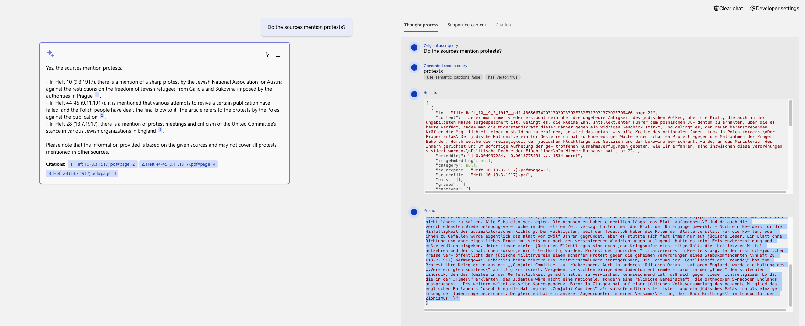

# Docs and Notes

##  Quick Links

- [Application link for Archive Companion](https://app-backend-ambj53mwk6u5g.azurewebsites.net/)
- [MS Example Repo for RAG Chat](https://github.com/Azure-Samples/azure-search-openai-demo)
- [Hackathon Repo](https://github.com/microsoft/AI-Chat-App-Hack)

## Todo

- [x] Check how the code works in detail
- [x] Read through doc: <<https://techcommunity.microsoft.com/t5/ai-azure-ai-services-blog/azure-ai-search-outperforming-vector-search-with-hybrid/-> ba-p/3929167>
- [x] Go through Search Approach: Understand what Hybrid Retrieval means
- [ ] Find out how expensive it was to build the App and how the cost was produced. (e.g. for Upload / Chunking for documents with 350 mb in total it was rougly 15 euros)
  - [ ] There is a split down between running costs and using Azure Document Intelligence to parse the documents.
- [ ] Watch the Custom RAG Chatvideo till the end. A lot of customisation opportunities: <https://www.youtube.com/watch?v=vt7oZg4bPAQ>
- [x] Go through "builidng a Rag Chat App to slide 26 - a code walkthrough! Very important!
- [ ] Add the Github ressources of the video to this doc: <https://www.youtube.com/watch?v=TI85JJVPnrM&t=1212> and  <https://github.com/sqlshep/OpenAI> - data pricacy etc. is mentionend there
- [ ] Add these repo for a lot of great patterns: <https://github.com/microsoft/azure-openai-design-patterns>

## A) RAG Basics


### Why RAG and not just GPT (an LLM)?

LLMs are good at Language but not at Reasoning. RAG is a combination of both. It is a hybrid approach.

- **Knowledge Cutoff**: There is a always a cut-off time for the training data of LLMs. So from this day on, the knowledge available is already outdated.
- **Only public knowledge**: LLMs are trained on public knowledge. All sources which are interal to a company or behind a paywall are not included in the training data.

### How can you incorporate your own knowledge?

- **Prompt Engineering**: You can give the LLM a bit of context but it only works if it has the knowledge inside it. Often it also halicinates knowledge which looks correct but if you are a domain expert you can see that it is wrong. So prompt engineering Can be helpful but normally not enough. => Example with Market Salad GPT and "Indian food"
- **Fine tuning**: You can fine tune the LLM on your own data. But this is very expensive and you need a lot of data. This is a valid option when your use case is very specialisd, you have a lot of data and you need very high accuracy, then this is probably the way to go. For most of company use cases it's not a good option economically.
- **Retrieval Augmented Generation (RAG)**: You can use a retrieval system to find the most relevant documents and then use the LLM to generate the answer. This is the approach we are using in this project.

### How does RAG work?

- The user asks a question, then you take it and search for fitting documents in a knowledge base.
- Afterwards you take the orginal user question together with the chunks from the knowledge base and feed it into the LLM to generate the answer.
- Typical for a RAG based system is that the user will get the sources of the answer as well, so he can evalute the answer himself.

### Explain typical RAG components


- **Retriver**: A knowledge base which is used to find the most relevant documents for a given question. This can be a search engine or a database which support vector search. (Azure Ai Search, CosmosDB, Postgres (<https://github.com/pgvector/pgvector>), Weaviate, Qdrant, Pineconce...)
- **LLM** A Model which can answers the questions based on the provided sources and can include citations (GPT3.5 / 4 Models, etc.)
- **Integration Layer ("Glue" in MS Slides)**: Optional Middleware which helps to connect the Retriver and the LLM. It can also be used to cache the results of the Retriver to speed up the process. It can be also done in pure Python but there are libaries which can help you with that. (Langchain, LLammaindex, Semantic Kernel, etc.)
- **Additional Features**: You can add additional features to your chatbot like chat history, Feedback buttons, Text to Speech, User Login, File Upload, etc.

### What kind of skillset is needed to build a RAG based chatbot?

- **No Code**: For easy applications using Copilot Studio of Azure or OpenApi GPT Builder. This might be enough for simple use cases.
- **Low Code**: UIs which help you to build more complex cases but within a UI (e.g. Azure Studio - On Your Data). There you can add hardware compontents (Retrievers as Azuer Ai Search, differen LLMs, Features as User Authentication, Chat History persistace.)
- **Code**: For Code base there are a lot of Azure Examples or for other suppliers as well. An example is the Azure RAG Chatbot which is used in this project <https://github.com/Azure-Samples/azure-search-openai-demo>.

## Explain how the repo works


### Process Flow

1. The user enters input into the Website.
2. The App Server/Orchestrator receives this input and formulates a query.
3. The query is sent to Azure Cognitive Search, which retrieves relevant knowledge from the connected Data Sources.
4. The retrieved knowledge, along with the original prompt, is sent to Azure OpenAI.
5. Azure OpenAI processes the prompt and knowledge to generate a natural language response.
6. This response is sent back to the App UX through the App Server/Orchestrator for the user to view.

### Architecture Components

| Resource Name     | Type                  | Role in Architecture                                                                      | Note |
|-------------------|-----------------------|-------------------------------------------------------------------------------------------|------|
| Website or other channel            | User Interface        | The front-end component where users interact with the chatbot.                            | Not an Azure infrastructure element; represents the user interface layer. |
| app-backend-xxx   | App Service           | Hosts the backend application that serves as the orchestrator between the App UX, Azure Cognitive Search, and Azure OpenAI. | Azure infrastructure element. |
| cfg-xxx           | Configuration/Settings| Manages configuration for document understanding and processing, possibly related to the chatbot’s AI model training and response formulation. | Azure infrastructure element. |
| gptkb-xxx         | Azure Cognitive Search| Handles data indexing and querying, pulling relevant information from various data sources to aid response generation. | Azure infrastructure element. |
| plan-xxx          | App Service Plan      | Determines the compute resources allocated for the App Service, affecting performance and scalability. | Azure infrastructure element. |
| stamjb-xxx        | Storage Account       | Stores blobs, files, and the data sources (like documents) used by the chatbot for information retrieval. | Azure infrastructure element. |
| Azure OpenAI      | AI Service            | Integrates with OpenAI's API to generate natural language responses based on user input and information from Azure Cognitive Search. | Represents the integration with an external AI service provided by OpenAI, not an Azure service itself. |
| Data Sources      | Various Databases     | Comprises SQL, blob storages, Cosomos DB and other data storage services that house the data the chatbot accesses. | Not a single Azure infrastructure element; this represents the actual data repositories, which may be hosted on Azure. |

### Deployment (steps in readme.md below)

- **Read the Cost Estimations Section**: Refer to the cost estimations section below before proceeding.
- **Deployment Guide**: Follow the deployment guide available at [Azure Deployment Guide](https://github.com/Azure-Samples/azure-search-openai-demo/tree/main?tab=readme-ov-file#azure-deployment).
- **Infrastructure Deployment**: The infrastructure, backend, and frontend will be deployed to Azure using the Bicep templates.
- **Configuration of Infrastructure**: Configurations for the infrastructure can be made through environment variables in the `azd.env` file.
- **Frontend and Backend Configuration**: Configuration for both the frontend and backend can be done in the `app` folder. (See below for details)
- **Interacting with the Bot**: Users can chat with the bot through the frontend. The frontend is developed as a React application.
- **Backend Details**: The backend is a Python application that utilizes the Quart framework.

### Ingestion of your Data [Azure Search OpenAI Demo - Data Ingestion Guide](https://github.com/Azure-Samples/azure-search-openai-demo/blob/main/docs/data_ingestion.md)


- `data` (folder) - Contains the data sources (PDFs, etc.) for the chatbot.
- `scripts` (folder) - Contains Python scripts to upload the data to Azure.
  - By default, these scripts will process the documents by splitting them into individual pages and then pass them to Azure Document Intelligence.
  - Alternatively, you can parse the documents locally and then upload them to Azure Search. This approach may be more cost-effective but requires additional effort.
- Within Azure, documents are stored in Blob Storage. Azure Form Recognizer handles the document chunking, creating embeddings from the text. These embeddings, along with the text itself, are then stored in an index within Azure Search.

#### How to deal with data which is not a PDF?

#### Converting webpages to PDFs

- Quick option is to save the webpage as PDF. Look in the slides of the Hackathon for more details and links.

#### Other approach: Write a a custom parser

- it's merged to the repo by now. In details, look again at the Hackathon slides. There is some documentation how this can be done.
- There is also a [youtube video](https://www.youtube.com/live/vt7oZg4bPAQ?si=Kzh4tBtZX5Oo3I6K&t=2602) where the custom parser is explained in detail.

### Chatting with the Bot

- **Frontend to Backend Communication**: The frontend captures the user's input and forwards it to the backend. The backend, in turn, sends this input to the OpenAI API and then relays the response back to the frontend.
- **Document Retrieval and Answer Generation**: In addition to interacting with the OpenAI API, the backend utilizes Azure Search to fetch documents, which are then used by the OpenAI API to formulate responses.
- **User Interface Tabs**: The interface offers two distinct tabs for interaction:
  - **Chat Tab**: Designed for multi-turn conversations, allowing for a more dynamic and engaging dialogue.
  - **Ask Tab**: Meant for single-turn queries, providing straightforward, concise answers.
- **Response Content**: Responses are comprehensive, including not only the direct answer but also citing the sources of the information. Additionally, the prompt used and the methodology behind generating the answer are disclosed, essentially revealing the "thought process."

### What does the thought process of the app looks like?

You can check that at the frontend. There is a button "Show Thought Process" which will show you the sources and the prompt which was used to generate the answer. It consisis of the following parts:



- **User Query**: The original question asked by the user.

```Javascript
  "user_query": "Do the sources mention protests?"
```

- **Generate Search Query**: The search query used to retrieve documents from the knowledge base.

```Javascript
  "generate_search_query": "protests"
```

- **Search Results**: The documents retrieved from the knowledge base.

```Javascript
  [
  {
    "id": "file-Heft_10__9_3_1917__pdf-486566742031302028392E332E31393137292E706466-page-21",
    "content": " Jeder mun immer wieder erstaunt sein uber die ungeheure Zähigkeit des jüdischen Volkes, über die Kraft, die auch in der ungebildeten Masse aufgespeichert ist. Gelingt es, die kleine Zahl intellektuenter Führer dem poinischen Ju- dentum zu erhalten, über die es heute verfügt, indem man die Widerstandskraft dieser Männer gegen ein widriges Geschick stärkt, und gelingt es, den neuen heranstrebenden Kräften die Mog- lichkeit einer Ausbildung zu erofinen, so wird das getan, was alle Kreise des nationalen Juden- tums in Polen fordern.\nDer Prager Erlaß\nDer jüdische Nationalverein für Oesterreich hat zu Ende wosiger Woche einen scharfen Protest -gegen die Mallaahmen der Prager Behörden, durch welche die Freizügigkeit der jüdischen Flüchtlinge aus Galizien und der bukowina be- schränkt wurde, an das Ministerium des Innern gerichtet und um sofortige Aufhebung der ge- troffenen Ausnahmsverfügungen gebeten. Wie wir erfahren, sind inzwischen diese Verordnungen sistiert worden.\nPolitische Rechte der Flüchtlinge\nIm Wiener Rathause hatte am 22.",
    "embedding": "[-0.004997284, -0.0013775431 ...+1534 more]",
    "imageEmbedding": null,
    "category": null,
    "sourcepage": "Heft 10 (9.3.1917).pdf#page=2",
    "sourcefile": "Heft 10 (9.3.1917).pdf",
    "oids": [],
    "groups": [],
    "captions": []
  },
  {
    "id": "file-Heft_44-45__9_11_1917__pdf-486566742034342D34352028392E31312E31393137292E706466-page-44",
    "content": "Schmiegsamkeit und geradezu anekelnden Anbiederungspolitik ver- mochte das Blatt sich nicht länger zu halten. Alle Subsidien versiegten. Die Abonnenten haben eigentlich längst das Blatt aufgegeben.\" Und da auch die verschiedensten Wiederbelebungsver- suche in der letzten Zeit versagt hatten, war das Blatt dem Untergange geweiht. - Noch ein Be- weis für die Hinfälligkeit der assimilatorischen Richtung. Den wuchtigsten, weil den Todesstoß haben die Polen dem Blatte versetzt. Für die Po- len, oder ihnen zu Gefallen wurde eigentlich das Blatt vor zwölf Jahren gegründet. aber es stützte sich fast immer nur auf jüdische Leser. Ein Blatt ohne Richtung und ohne eigentliches Programm. stets nur nach den verschiedenen Windrichtungen auslugend, hatte es keine Existenzberechtigung und mußte endlich eingehen.\nUnter diesen vielen jüdischen Flüchtlingen sind noch jene Kriegsopfer nicht mitgezählt. die ihre letzten Mittel aufzehren und der staatlichen Fürsorge nicht tellhaftig wurden.\nProtest des jüdischen Militärvereines in Pe- tersburg. In der russisch-jüdischen Presse ver- öffentlicht der jüdische Militärverein einen scharfen Protest gegen die geheimen Verordnungen eines Stabskommandanten ",
    "embedding": "[-0.02443394, -0.004634023 ...+1534 more]",
    "imageEmbedding": null,
    "category": null,
    "sourcepage": "Heft 44-45 (9.11.1917).pdf#page=4",
    "sourcefile": "Heft 44-45 (9.11.1917).pdf",
    "oids": [],
    "groups": [],
    "captions": []
  },
  {
    "id": "file-Heft_28__13_7_1917__pdf-48656674203238202831332E372E31393137292E706466-page-46",
    "content": " Ueberdies haben mehrere Pro- testversammlungen stattgefunden, Die Leitung der „Gesellschaft der Freunde\" hat zum Protest ihre Delegierten aus dem „,Conjoint Comittee“ zu- rückgezogen. Auch in anderen jüdischen Organi- sationen Englands wurde die Haltung des „,Ver- einigten Komitees\" abfällig kritisiert. Vergebens versuchten einige dem Judentum entfremdete Lords in der „Times“ den schlechten Eindruck, den das Komitee in der Oeffentlichkeit gemacht hatte, zu verwischen. Kennzeichnend ist, daß sich gegen diese nichtreligiösen Lords, die in der „Times\" erklärten, das Judentum wäre nicht eine nationale, sondern eine religiose Gemeinschaft, die orthodoxen Synagogen Englands aussprachen; - Des weitern meldet dasselbe Korrespondenz- Buro: In Glasgow hat auf einer jüdischen Volksversammlung das bekannte Mitglied des englischen Parlaments Joseph King die Haltung des „Conjoint Comitee\" als volksfeindlich kri- tisiert und ein jüdisches Palästina als einzige Lösung der Judenfrage bezeichnet. Desgleichen hat ein anderer Abgeordneter in einer Versamm'- lung der „Bnci Brithloge\" in London für den Zionismus ",
    "embedding": "[-0.015009237, 0.0012998359 ...+1534 more]",
    "imageEmbedding": null,
    "category": null,
    "sourcepage": "Heft 28 (13.7.1917).pdf#page=4",
    "sourcefile": "Heft 28 (13.7.1917).pdf",
    "oids": [],
    "groups": [],
    "captions": []
  }
]
```

- **Prompt to GPT**: The prompt used to generate the answer. It includes a context for the GPT model, the orginal user request and the search results (text of the sources which was found to answer the query).

```Javascript
  [
  "{'role': 'system', 'content': '\\n            This assistant is designed to support academic researchers, particularly historians, by extracting and providing precise information from a designated list of sources. \\n\\n            Guidelines for the Assistant:\\n            1. Deliver Accurate and Relevant Information: Focus on accuracy and relevance in your responses. \\n            2. Brevity: Keep answers concise and to the point.\\n            3. Source-Based Responses: Only use facts from the provided list of sources. If a source lacks sufficient information, admit the limitation. Avoid creating responses that do not directly utilize these sources.\\n            4. Clarifying Questions: If clarification from the user could lead to a more accurate response, do not hesitate to ask.\\n            5. Response Formatting: For responses involving tabular data, present them in HTML format. Avoid using markdown.\\n            6. Language Consistency: Answer in the same language as the question posed.\\n            7. Source Attribution: Include the name of the source for every fact cited in your response. Use square brackets for source referencing, e.g., [info1.txt]. Do not merge information from different sources; cite each one separately, e.g., [info1.txt][info2.pdf].\\n\\n            \\n            \\n        '}",
  "{'role': 'user', 'content': 'Do the sources mention protests?\\n\\nSources:\\nHeft 10 (9.3.1917).pdf#page=2:  Jeder mun immer wieder erstaunt sein uber die ungeheure Zähigkeit des jüdischen Volkes, über die Kraft, die auch in der ungebildeten Masse aufgespeichert ist. Gelingt es, die kleine Zahl intellektuenter Führer dem poinischen Ju- dentum zu erhalten, über die es heute verfügt, indem man die Widerstandskraft dieser Männer gegen ein widriges Geschick stärkt, und gelingt es, den neuen heranstrebenden Kräften die Mog- lichkeit einer Ausbildung zu erofinen, so wird das getan, was alle Kreise des nationalen Juden- tums in Polen fordern. Der Prager Erlaß Der jüdische Nationalverein für Oesterreich hat zu Ende wosiger Woche einen scharfen Protest -gegen die Mallaahmen der Prager Behörden, durch welche die Freizügigkeit der jüdischen Flüchtlinge aus Galizien und der bukowina be- schränkt wurde, an das Ministerium des Innern gerichtet und um sofortige Aufhebung der ge- troffenen Ausnahmsverfügungen gebeten. Wie wir erfahren, sind inzwischen diese Verordnungen sistiert worden. Politische Rechte der Flüchtlinge Im Wiener Rathause hatte am 22.\\nHeft 44-45 (9.11.1917).pdf#page=4: Schmiegsamkeit und geradezu anekelnden Anbiederungspolitik ver- mochte das Blatt sich nicht länger zu halten. Alle Subsidien versiegten. Die Abonnenten haben eigentlich längst das Blatt aufgegeben.\" Und da auch die verschiedensten Wiederbelebungsver- suche in der letzten Zeit versagt hatten, war das Blatt dem Untergange geweiht. - Noch ein Be- weis für die Hinfälligkeit der assimilatorischen Richtung. Den wuchtigsten, weil den Todesstoß haben die Polen dem Blatte versetzt. Für die Po- len, oder ihnen zu Gefallen wurde eigentlich das Blatt vor zwölf Jahren gegründet. aber es stützte sich fast immer nur auf jüdische Leser. Ein Blatt ohne Richtung und ohne eigentliches Programm. stets nur nach den verschiedenen Windrichtungen auslugend, hatte es keine Existenzberechtigung und mußte endlich eingehen. Unter diesen vielen jüdischen Flüchtlingen sind noch jene Kriegsopfer nicht mitgezählt. die ihre letzten Mittel aufzehren und der staatlichen Fürsorge nicht tellhaftig wurden. Protest des jüdischen Militärvereines in Pe- tersburg. In der russisch-jüdischen Presse ver- öffentlicht der jüdische Militärverein einen scharfen Protest gegen die geheimen Verordnungen eines Stabskommandanten \\nHeft 28 (13.7.1917).pdf#page=4:  Ueberdies haben mehrere Pro- testversammlungen stattgefunden, Die Leitung der „Gesellschaft der Freunde\" hat zum Protest ihre Delegierten aus dem „,Conjoint Comittee“ zu- rückgezogen. Auch in anderen jüdischen Organi- sationen Englands wurde die Haltung des „,Ver- einigten Komitees\" abfällig kritisiert. Vergebens versuchten einige dem Judentum entfremdete Lords in der „Times“ den schlechten Eindruck, den das Komitee in der Oeffentlichkeit gemacht hatte, zu verwischen. Kennzeichnend ist, daß sich gegen diese nichtreligiösen Lords, die in der „Times\" erklärten, das Judentum wäre nicht eine nationale, sondern eine religiose Gemeinschaft, die orthodoxen Synagogen Englands aussprachen; - Des weitern meldet dasselbe Korrespondenz- Buro: In Glasgow hat auf einer jüdischen Volksversammlung das bekannte Mitglied des englischen Parlaments Joseph King die Haltung des „Conjoint Comitee\" als volksfeindlich kri- tisiert und ein jüdisches Palästina als einzige Lösung der Judenfrage bezeichnet. Desgleichen hat ein anderer Abgeordneter in einer Versamm\\'- lung der „Bnci Brithloge\" in London für den Zionismus '}"
]
```

### Azure AI Search Pricing Insights

- The main cost driver was Azure AI Search, not OpenAI.
- Standard S1 Plan: $245/month, necessary for >2GB data. [Azure Search Pricing Details](https://azure.microsoft.com/en-gb/pricing/details/search/).
- For up to 2GB of data: $75/month.

### Cost Reduction Strategies

- Explore free or lower-cost deployment options:
  - [Low-cost Deployment Guide](https://github.com/Azure-Samples/azure-search-openai-demo/blob/main/docs/deploy_lowcost.md)
  - [Instructional Video for Low-Cost Deployment](https://www.youtube.com/watch?v=nlIyos0RXHw)

## B) How to customize the RAG Chatbot <https://www.youtube.com/watch?v=vt7oZg4bPAQ>

### How to run the chatbot locally

Watch also the video which explains this in detail. There is also the option to use the VC Code debugger to go through the code step by step. 

#### Hotloading the Backend

- go to your local folder in vs code, open a terminal and run

```bash
  cd app
./start.sh
```

This will load the azd env file and start the backend and frontend. It automatically reloads the backend if you change something in the code.

- The backend is done on Quart (a Python framework based on Flask which supports async). It is a bit different from Flask but the same concepts apply. The frontend is in the folder `app/backend`. If you build a openai chat app like this, your backend should support async. The reasoning you can find in detail here: <https://blog.pamelafox.org/2023/09/best-practices-for-openai-chat-apps.html>

#### Hotloading the Frontend

- go to your local folder in vs code, open another terminal and run

```bash
  cd app/frontend
  npm run dev
```

then

  ```bash
    npm run dev
  ```

- this will give you a seperate localhost:5173 where you can see the frontend. It automatically reloads the frontend if you change something in the code. The backend request are going to the local server you've spun up in the other terminal.
- Be aware that in company network you may recieve proxy errors.

###  Code Walkthrough

#### Frontend

- **Technology**: TypeScript
- **Libraries/Frameworks**: React, FluentUI
- **Functionality**:
  - `chat.tsx`: Contains the UI components for the chat interface.
    - `makeApiRequest()`: Function to send requests to the backend API.
  - `api.ts`: Manages the API calls.
    - `chatApi()`: Interface to communicate with the chat service in the backend.

#### Backend

- **Technology**: Python
- **Libraries/Frameworks**: Quart, Uvicorn
- **Functionality**:
  - `app.py`: Main application file.
    - `chat()`: Function that handles chat requests.
  - `chatreadretrieveread.py`: Module for retrieving chat history and processing requests.
    - `run()`: Main entry point for running the chat service.
    - `get_search_query()`: Function to retrieve the search query from a request.
    - `compute_text_embedding()`: Function to compute embeddings for text analysis.
    - `search()`: Function to execute the search based on the query and embeddings.
    - `get_messages_from_history()`: Function to retrieve past messages for context.
    - `chat.completions.create()`: Function to generate chat responses.

### Customizing the frontend

To customize specific elements of the application, you should modify the following files:

| Change this file:                         | To customize:                 |
|-------------------------------------------|-------------------------------|
| `app/frontend/index.html`                 | title, metadata, script tag   |
| `app/frontend/public/favicon.ico`         | browser tab icon             |
| `app/frontend/src/pages/layout/Layout.tsx`| Navigation bar, colors        |
| `app/frontend/src/pages/chat/Chat.tsx`    | "Chat" tab and default settings |
| `app/frontend/src/pages/ask/Ask.tsx`      | "Ask" tab and default settings  |

### Customizing the backend

To customize specific elements of the backend, you should modify the following files:

| Change this file:                                     | To customize:                       |
|-------------------------------------------------------|-------------------------------------|
| `app/backend/app.py`                                  | additional routes, app configuration|
| `app/backend/approaches/chatreadretrieveread.py`      | "Chat" tab, RAG prompt and flow     |
| `app/backend/approaches/chatreadretrievereadvision.py`| "Chat" tab, RAG flow when using vision - this is still experimental in this current state|
| `app/backend/approaches/retrieveread.py`              | "Ask" tab, RAG prompt and flow      |
| `app/backend/approaches/retrievereadvision.py`        | "Ask" tab, RAG flow when using vision |

### Frontend - What is the Chat and Ask Tab?

- The Chat Tab is the tab where you can chat with the bot. You get the answer can ask follow up questions based on this. It's got context. It's a multi-turn conversation.
- The Ask Tab is the tab where you can ask a question and get an answer. It's a single turn conversation.

### [ ] Check if there is still things missing in this section

## Azure AI Search Best Practices <https://www.youtube.com/watch?v=ODuDeDrs3F0>

### Retrieval Matters

- As by experience of the MS team, the retrieval is the most important part of the RAG Chatbot. If the answers are not good the cause behind this is often not the LLM but the retrieval.
- So it is important to work on a rebust retrieval system for RAG chat apps.
- For best results in Azure Ai Search, you will probably want to use a hybrid approach.
  - **Vector search** + **Keyword search** in parellel
  - Using a **RFF** (Reciprocal Rank Fusion) to combine the results of both methods
  - Then use the **Semantic Ranking** to rank the top results from the hybrid search

See the following slides for more details:
<https://speakerdeck.com/pamelafox/azure-ai-search-best-practices-for-rag-chat-apps?slide=6>

### Vector Search

What is Vector Search based on? What are their strengths and weaknesses?

#### Vector embeddings

- Take a text and convert it into a list of floating point numbers (vector), so the the text is represented as a vector.
- There are very different models for this. The most common ones are:
  - **Word2Vec**: A classic model which takes in words
  - **OpenAi ada-002**: A model which takes in sentences
  - **Azure Computer Vision**: A model which takes in images or text
  
#### Demo how to compute a vector and use it for search with OpenAi ada-002 vector embeddings

Source: <https://github.com/pamelafox/vector-search-demos/blob/main/vector_embeddings.ipynb>

- create a vector representation of a text (list of floating point numbers)
- with this vector you can search for similarities to other embeddings. For this you calculate the distance, usually the cosine distance. The code shows a couple of examples. It's important to mention that it's the relevant distance between the cosines not the absolutes.
- in the demo there is a list of movies already as embeddings. If you query e.g. "Barbie" it showed "Babies in Toyland" and "Shopgirl" as the highest scores.
- => it's not only the wording but also the context, the meaning, etc. which is included in the vector. The specifics depends on the model you are using.

## Learnings

### 1. What is an optimal chunk size and a optimal overlap?

- There is a blog post of MS which researched on this: [Azure AI Search: Outperforming vector search with hybrid retrieval and ranking capabilities](https://techcommunity.microsoft.com/t5/ai-azure-ai-services-blog/azure-ai-search-outperforming-vector-search-with-hybrid/ba-p/3929167)
- They compared methods with different chunk sizes and different overlap sizes for Azure Ai Search.
- Hybrid Retrieval (Keyword + Vectore search paired with Semantic Ranking) using chunks with 512 tokens and 25% overlap performed best.

#### Technology behin Azure Ai Search

There are two main layers in Azure Ai Search:

- **Layer 1**: Retrieval - search for the most relevant documents. There are three methods supporte in Ai Search:
  - **Keyword**: Traditional keyword search. It is the fastest but least accurate.
  - **Vector**: Uses embeddings and cosine similarity to find the most similar documents. It is more accurate but slower.
  - **Hybrid**: Combination of Keyword and Vector. For Azure Ai Search they are using Reciprocal Rank Fusion (<https://learn.microsoft.com/en-us/azure/search/vector-search-ranking#reciprocal-rank-fusion-rrf-for-hybrid-queries>).
- **Layer 2**: Ranking - Prioritize the most relevant results. There is one method supported in Ai Search:
  - **Semantic Ranking**: Uses a mulit-lingual, deep learning model adapted from Bing Search. It can rank the top 50 results from L1.

#### Experiments for Search Methods

- They tested the different methods with different query types and different retrieval configurations.
- In both cases Hybrid retrieva with semantic ranking outperformed the other methods (namely Keyword, Vector and pure Hybrid).

#### Experiment for Chunking Strategies

- The paper compared different chunking and overalapping of chunks for the Hybrid Retrieval.
- The best results were Chunks of 512 tokens with 25% overlap.

#### What to do with these results in CAI?

- This might be useful for data scientists in CAI as Chunink Strategy was one of the major questions by Francesc.
- Keep in mind that the benchmarks are common benchmarks and might lead to different results in your specific use case.
- The results are only valid for Azure Ai Search and might be different for other search engines. Especially the "Semantic Rankig" is a proprietary method of Microsoft. It has to be checked what this methods does exactly and if it is available in other search engines as well.

### Further interesting points

#### TODO: What kind of Skillsets are needed for building a RAG Chatbot?

- Frontend / Backend: Classical Web Developer
- Data Preparation: Data Engineer

#### TODO: What are your most important learnings and why?

- Cost estimations are really hard for this use case. It depends a lot on the size of the documents, your chunking strategy, the number of documents, the number of users, the number of requests, etc.
- ==> What is the best way to estimate the costs for a RAG Chatbot?

#### TODO: Top Challenges

###  Cost Estimations

### Lessons Learned: Do courses - always include hands on parts

- For non-technical people:
  - The Course by Nng
  - then some hands one with Azure portal ressources?
- For technical people:
  - Hackathons..
- Use the Allianz Boost!

### Lessons Learned: Managing Costs

There is [guide to determine Azure costs](https://github.com/microsoft/AI-Chat-App-Hack) in the Hackathon Repo. It's worth to read it in detail.

- Parsing: High-quality data parsing incurs high costs. For example, parsing 20 PDFs (87MB) led to a $30 charge.
  - Microsoft's Advice: Use the local PDF parser to avoid such costs. Incorporate `--localpdfparser` in `prepdocs.sh`. This option is free and can be sufficient. [Discussion on Data Parsing Costs](https://github.com/microsoft/AI-Chat-App-Hack/discussions/45).
  - Note: OCR is notably expensive and should be used sparingly.
- SKUs: Keeping the data size small is crucial for cost management. SKUs fix costs can reach very high. See pricing details for [Azure Cognitive Search](https://azure.microsoft.com/en-gb/pricing/details/search/).
- The openAi model was not the cost driver in my project but in real world it might be as well depending on the usage. You might want to implement a strategy to watch the toke usage and set up alerts.
- It's worth it to spend more time on data preparation to avoid unnecessary costs. Do a proof of concept to evaluate this costs. It's worth it to spend time on this!
  - create an example case with the needed infra. Check cost drivers on a limited set.
  - make sure you can identify the cost drivers and set up alerts for them.

### Lessons Learned: User Interaction to GPT Model

- You probably do not want to give the user direct access to the GPT model behind for minimum two reasons:
  - the results of the chat are heavily dependent on the quality of the query. In this current architecture, the query will be send directly to the Knowledge Base. The results back for this are often not very good, if it's not formulated in a specific way, easy to consume for the knowledge base. Probably it's better to have a middleware which can help to improve the query before it's send to the knowledge base.
  - You don't want to expose the knowledge base to the user. It's a security risk. You want to have a middleware which can help to improve the query before it's send to the knowledge base.
- For this, Cognigy can acutally bring a great value, if it will be transformed into an orchstrator for knowledge base & gpt.

### Lessons Learned: Cogingy

They are doing a lot of things which is described in these Azure Ressources

- Knowlegd Base is basically the same as the RAG repository (<https://github.com/Azure-Samples/azure-search-openai-demo/tree/main>)
-

##### Evaluation if data was read correctly

- There might be a lot of noise in the data....

....

### Further Improvements

- Implement the Text Recognition for "Fraktur" (old german font) by using Transkribus OCR <https://readcoop.eu/transkribus/docu/rest-api/upload/>.


###  Hot to put the chatbot into production

[Setting this bot into production](https://github.com/Azure-Samples/azure-search-openai-demo/blob/main/docs/productionizing.md)

###  Next Learning steps

- Lang Chain: This is a middleware which can be used to connect the Retriver and the LLM. It can also be used to cache the results of the Retriver to speed up the process. It can be also done in pure Python but there are libaries which can help you with that. (Langchain, LLammaindex, Semantic Kernel, etc.)
- Azure OpenAI Design Patterns:
  - Knowledge Search with Embeddings => this is Azure Cognitive Search Database <https://github.com/ruoccofabrizio/azure-open-ai-embeddings-qna>
- Prompt Engineering:
